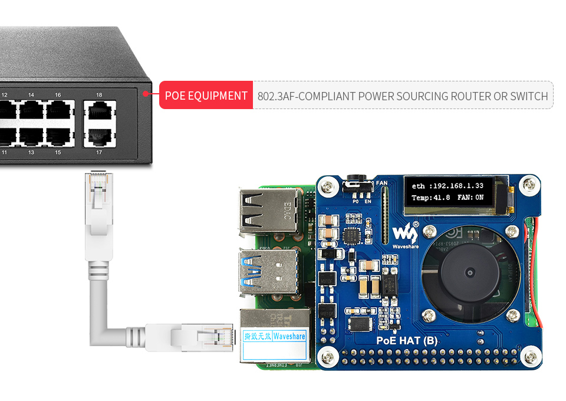
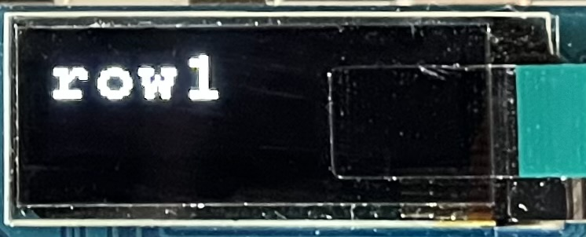
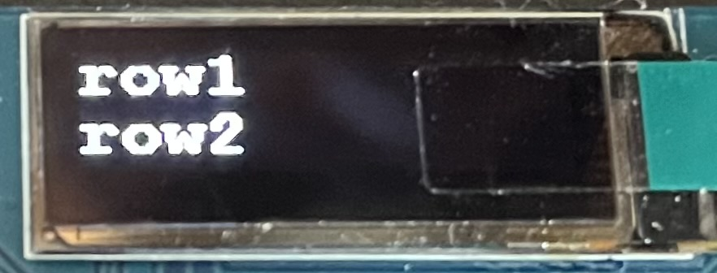
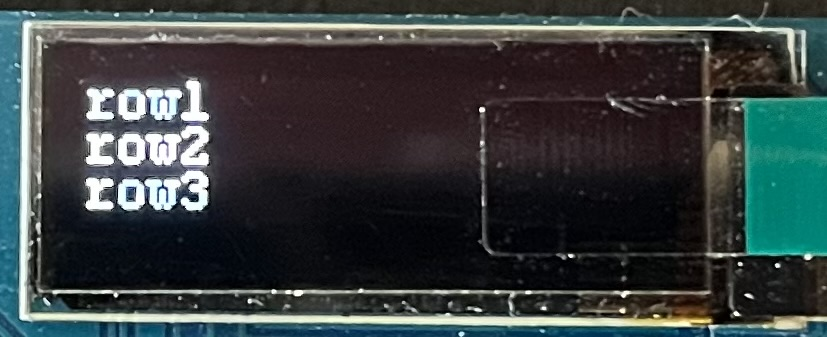
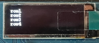
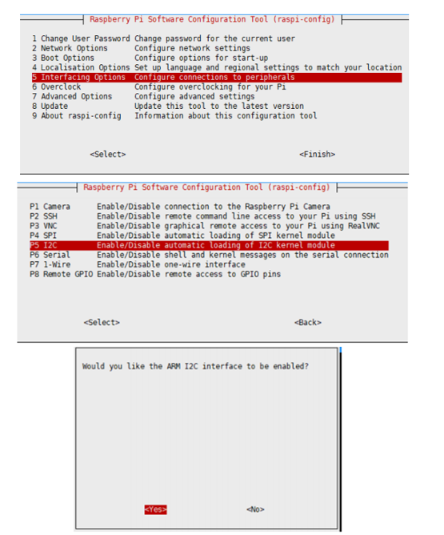

[](https://hub.docker.com/r/pietmacom/waveshare-poe-hat-b-cli)

# Waveshare PoE HAT CLI (Command Line Interface)
Small command line interface for Waveshare PoE HAT B with OLED Display. 



Find this project on GitHub [https://github.com/pietmacom/waveshare-poe-hat-b-cli](https://github.com/pietmacom/waveshare-poe-hat-b-cli) and on DockerHub [https://hub.docker.com/r/pietmacom/waveshare-poe-hat-b-cli](https://hub.docker.com/r/pietmacom/waveshare-poe-hat-b-cli)

## Features

 - Docker Image
 - Command line interface
   - Turn fan on and off
   - View up to four lines on your OLED Display (size and positions are adapted automatically)
 - Binray does not have to be recompiled to view different content
 - Small binary
 - Almost no dependencies

## Docker

***Run simple script [simple.sh](simple.sh)***

```shell
foo@bar:~$ docker run --privileged -it pietmacom/waveshare-poe-hat-b-cli
```

```bash
#!/bin/sh -e

_fanState="off"
_fanOnTemperature="40000"
_fanOffTemperature="35000"

while true; do
    _temperature="$(cat /sys/class/thermal/thermal_zone0/temp)"

    _temperatureViewAwk="BEGIN { printf \"%.2f C\", (${_temperature}/1000) }"
    _temperatureView=$(awk "${_temperatureViewAwk}";)

    if [[ "${_temperature}" -gt "${_fanOnTemperature}" ]]; then
        _fanState="on"
    elif [[ "${_temperature}" -lt "${_fanOffTemperature}" ]]; then
        _fanState="off"
    fi

    ./waveshare-poe-hat-b-cli fan ${_fanState}
    ./waveshare-poe-hat-b-cli oled "T: ${_temperatureView}" "F: ${_fanState}"
    sleep 3
done
````
<div style="width: 50%; height: 50%">


</div>

***Run your own script***

Copy [***simple.sh***](simple.sh), make your changes and mount it into your new container.

```shell
foo@bar:~$ docker run --privileged -it -v yourscript.sh:/root/script.sh pietmacom/waveshare-poe-hat-b-cli
```

***Docker Compose***
```yaml
version: '3'

services:
  waveshare-poe-hat-b-cli:
    image: pietmacom/waveshare-poe-hat-b-cli:latest
    privileged: true
    restart: "unless-stopped"
```
## Command Line (Shell)

### Control FAN

```shell
foo@bar:~$ sudo ./waveshare-poe-hat-b-cli fan on
Fan turned on!

foo@bar:~$ sudo ./waveshare-poe-hat-b-cli fan off
Fan turned off!
```

### Control OLED

```shell
foo@bar:~$ sudo ./waveshare-poe-hat-b-cli oled "row1"
row 1: row1
```
<div style="width: 50%; height: 50%">



</div>

```shell
foo@bar:~$ sudo ./waveshare-poe-hat-b-cli oled "row1" "row2"
row 1: row1
row 2: row2
```
<div style="width: 50%; height: 50%">



</div>

```shell
foo@bar:~$ sudo ./waveshare-poe-hat-b-cli oled "row1" "row2" "row3"
row 1: row1
row 2: row2
row 3: row3
```
<div style="width: 50%; height: 50%">



</div>

```shell
foo@bar:~$ sudo ./waveshare-poe-hat-b-cli oled "row1" "row2" "row3" "row4"
row 1: row1
row 2: row2
row 3: row3
row 4: row4
```
<div style="width: 50%; height: 50%">



</div>

## Enable I2C Interface

I2C interface is required for the OLED display, you need to first enable the i2c interface for properly work.
Open a terminal of Raspberry Pi and configure:

```shell
foo@bar:~$ sudo raspi-config
Interfacing Options -> I2C -> Yes
```



And then reboot the system.

```shell
foo@bar:~$ sudo reboot
```

## Compile

```shell
foo@bar:~$ cd src
foo@bar:~$ ./make clean
foo@bar:~$ ./make
```
 
## References

Documentation [https://www.waveshare.com/wiki/PoE_HAT_(B)](https://www.waveshare.com/wiki/PoE_HAT_(B))
